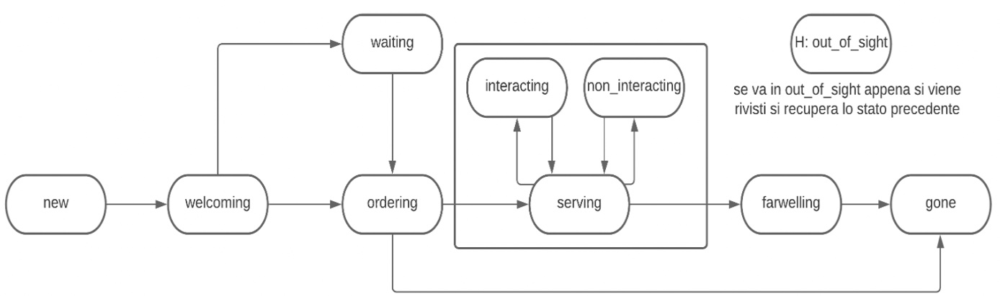

# 🤖 Robot States Project LSO-2023    

#### ↬ Development of an Android Application in Java (for mobile or tablet) and a Server in C, aimed at managing Robot States through a theoretical description based on Finite State Machines.

## 📑 Possible Robot States and Descriptions

- **New**: A new user has arrived.
- **Welcoming**: The robot greets the user.
- **Waiting**: The user waits for their turn to order.
- **Ordering**: The robot suggests a drink, and the user can confirm or request another.
- **Serving**: Preparation of the requested drink.
- **Interacting**: Possible interaction phase with the user during drink preparation waiting time.
- **Non-Interacting**: The user has declined the possibility of interaction.
- **Farewelling**: The drink is ready, and the user is notified.
- **Gone**: The user has left.
- **Out-of-sight**: The user has temporarily moved away.

## 🏬 Project Information

- **University**: University of Naples "Federico II"
- **Department**: Department of Electrical Engineering and Information Technologies
- **Degree Program**: Computer Science
- **Course**: Operating Systems Laboratory Exam

